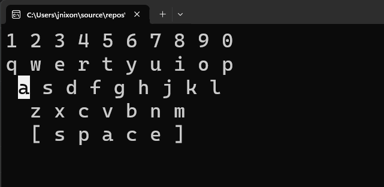

# Assignment 02



## Universal Acceptance Criteria

This represents acceptance criteria that is true irrespective of assignment criteria.

1. You **must understand** every single line of your solution.
2. Your code **must compile and run** without errors.
3. You **must turn in your repository URL** in Brightspace.

## Assignment Acceptance Criteria

This represents acceptance criteria necessary for assignment completion.

1. Show a standard QWERTY keyboard.
1. Listen for a keypress and respond.
1. Highlight the key pressed.
1. Unhighlight any previous key presses.
1. Handle both upper & lower case keys.
1. Handle numbers as well as letters.
1. Handle the space bar (see the screenshot).
1. Place as much logic as possible in `Client.Library`.
1. Hide the cursor in the console app.

## Bonus Acceptance Criteria

This represents optional acceptance criteria available for additional learning and bonus. You must complete both.

1. Every time a key is pressed play a short console beep. 
1. When I type the key series "password" clear the screen and write "SECRET". *This one task is pretty complex and will be difficult for you to complete. Clearing the screen and writing SECRET after password will require clever logic you might need AI or a friend to help you complete. Fine. Just remember, you need to understand your code. Don't submit a solution you don't understand.*

### Useful information

`Console.ReadKey().Key` lets you read and identify key presses in a C# console application. The `Console.ReadKey()` method waits for the user to press a key and gives back a `ConsoleKeyInfo` object. That object includes details like what key was pressed and whether Shift, Alt, or Ctrl was used. The `.Key` property specifically tells you which key was pressed, using the `ConsoleKey` enum, with values like `Enter`, `Escape`, or `A`. It’s a simple and effective way to handle user input.

```csharp
Console.WriteLine("Press any key:");
// Reads the keypress as keyInfo metadata
ConsoleKeyInfo keyInfo = Console.ReadKey(); 
// Extracts the key itself from keyInfo metadata
ConsoleKey key = keyInfo.Key; 
Console.WriteLine($"\nYou pressed: {key}");
```

## Getting Started

1. **Clone Your Repository**

   - GitHub Classroom: https://classroom.github.com/a/xLLZSm4E
   - Open the new, local folder
   

1. **Configure Debugging**

   - Open Settings (`Ctrl+,`) and search for `csharp.debug.console`.
   - Set its value to `externalTerminal`.

1. **Create Solution Structure**

```text
Assignment02.sln
├── .gitignore
├── .editorconfig
├── Client
│   ├── Client.csproj
│   ├── Program.cs 
│   └── References: Client.Library
└── Client.Library
    ├── Client.Library.csproj
    └── Class1.cs (Rename to Logic.cs)
```

This is the command line, try doing it inside VS Code using the user interface. The result is the same, using the UI inside Code just helps you learn how it works. You can always "fall back" to this command line syntax.

```bash
// create base files
dotnet new gitignore
dotnet new editorconfig

// create the projects
dotnet new console -n Client -o Client
dotnet new classlib -n Client.Library -o Client.Library
dotnet add Client/Client.csproj reference Client.Library/Client.Library.csproj

// create the solution
dotnet new sln -n Assignment02
dotnet sln Assignment02.sln add Client/Client.csproj
dotnet sln Assignment02.sln add Client.Library/Client.Library.csproj

// test the app
dotnet restore
dotnet build
dotnet run --project Client
```

> Unlike the last assignment, do not use the command palette to create debug assets. Running this command creates the `launch.json` and `tasks.json` files in the `.vscode` folder. This is very valuable for sophisticated scenarios, but not ours—this is simple. 

### Now you can do your assignment

 * Read the *Acceptance Criteria*!
 * Keep committing your changes with git.
 * Remember to push your final work!
 * Turn in the URL to your repository.
